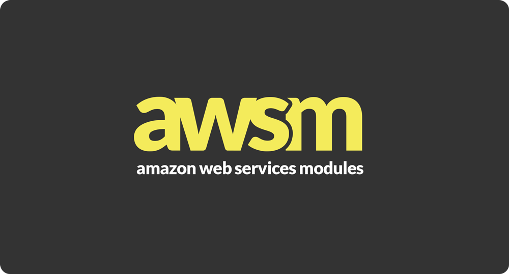

AWSM: Amazon Web Services Modules
=================================

**Amazon Web Services Modules (aws-modules)** contain one or multiple AWS Lambda functions,
plus their AWS resource dependencies defined via AWS CloudFormation.  The purpose of aws-modules is to encourage the development of lambda functions
designed for re-use and easy installation into applications.

aws-modules were designed to work with [JAWS: The Serverless AWS Framework](https://github.com/jaws-framework/JAWS).
The JAWS command line tool gives you handy commands to rapidly create and install aws-modules into your serverless applications.
View the JAWS documentation for more information.

## Structure

This is the directory structure of an aws-module with one lambda function:

```
awsm.json 			// Contains a "resources" property for the other resources required by this module and publishing information (name, author, etc.).
create				// Action/lambda level directory (Required)
	awsm.json 		// Contains a "lambda" property and a "endpoint" property for this lambda
	handler.js 		// Lambda function handler (JS example. Can be in any language AWS Lambda supports)
	index.js 	  	// Modular code you can require in this or other lambda functions (JS example).
	package.json 	// For JS lambdas, include package.json here.  Require it in index.js
```

This is the directory structure of an aws-module with multiple lambda functions:

```
awsm.json 			// Contains a "resources" property for the other resources required by this module and publishing information (name, author, etc.).
create 				// Action/lambda level directory (Required)
	awsm.json 		// Contains a "lambda" property and a "endpoint" property for this lambda
	handler.js 		// Lambda function handler (JS example. Can be in any language AWS Lambda supports)
	index.js 	  	// Modular code you can require in this or other lambda functions.
	package.json 	// For JS lambdas, include package.json here.  Require it in index.js
show 				// Action/lambda level directory (Required)
	awsm.json 		// Contains a "lambda" property and a "endpoint" property for this lambda
	handler.js 		// Lambda function handler (JS example. Can be in any language AWS Lambda supports)
	index.js 	  	// Modular code you can require in this or other lambda functions.
	package.json 	// For JS lambdas, include package.json here.  Require it in index.js
update 				// Action/lambda level directory (Required)
	awsm.json 		// Contains a "lambda" property and a "endpoint" property for this lambda
	handler.js 		// Lambda function handler (JS example. Can be in any language AWS Lambda supports)
	index.js 	  	// Modular code you can require in this or other lambda functions.
	package.json 	// For JS lambdas, include package.json here.  Require it in index.js
delete 				// Action/lambda level directory (Required)
	awsm.json 		// Contains a "lambda" property and a "endpoint" property for this lambda
	handler.js 		// Lambda function handler (JS example. Can be in any language AWS Lambda supports)
	index.js 	  	// Modular code you can require in this or other lambda functions.
	package.json 	// For JS lambdas, include package.json here.  Require it in index.js
```
Remember, your lambda functions should be a thin wrapper around your own separate modules, to keep your code
testable, reusable, and AWS independent.  Basically, put as little code as you can in **handler.js** and put all code
in **index.js** and additional files.

## Configuration

aws-modules' configuration settings and dependencies are described in **awsm.json** files located in the module.

At the module's root, you should have an **awsm.json** file which describes publishing information as well as
AWS resources outside of the Lambda and API Gateway resources your module requires in the "resources" object:

```
"name": "usersCreate",
"description": "Creates a user",
"version": "0.0.1",
"location": "github.com/you/your_aws_modules_repo",
"resources": {
	"cloudFormation": {
		"PolicyDocuments": [ ],
		"Resources": { }
	}
}
```

Within each resource/action directory is another **awsm.json** which describes either an AWS Lambda configuration,
an API Gateway configuration, or both.  awsm.json files within resource/action directories only need a "lambda" or
"apiGateway" property, or both.

```
"lambda": {
	"cloudFormation": {
		"Description": "",
		"Handler": "",
		"MemorySize": 1024,
		"Runtime": "nodejs",
		"Timeout": 6
	}
},
"apiGateway": {
	"cloudFormation": {
		"Type": "AWS",
		"Path": "users/create",
		"Method": "POST",
		"AuthorizationType": "none",
		"ApiKeyRequired": false,
		"RequestTemplates": {},
		"RequestParameters": {},
		"Responses": {
			"default": {
				"statusCode": "200",
				"responseParameters": {},
				"responseTemplates": {
				"application/json": ""
			}
		},
		"400": {
			"statusCode": "400"
		}
	}
}
```